# 단어탐정 - 아이들을 위한 무료 AI 결합형 한글 교육 어플리케이션

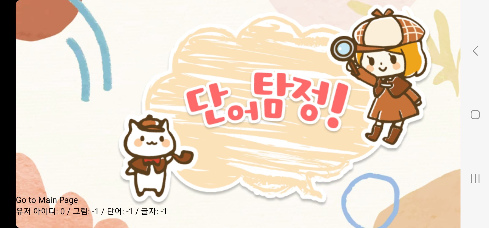

## 소개 영상 보기 : [UCC 링크](https://youtu.be/UZKUr7McmJw)

## 프로젝트 진행 기간

2023.08.14(월) ~ 2023.10.06(금)
 
SSAFY 9기 2학기 특화 프로젝트

 

## 단어탐정 - 배경

요새 늘어나는 미취학 아동 한글 교육의 수요로 인해 높아지는 한글 교육의 비용이 부담스러워졌습니다. 그런 사람들을 위해 AI를 이용한 저비용 한글 단어 교육 어플리케이션을 제작했습니다.

 

## 단어탐정 - 개요

_- 아이들이 재미있게 한글 단어를 배울 수 있도록 -_

**단어탐정**은 사진의 AI분석, 글자 인식 AI를 이용하여 한글 단어를 가르쳐주는 어플리케이션입니다.
요새 비용이 높은 한글 교육으로 인해 부담감을 느끼는 학부모가 많아지고 있습니다.
 그런 분들을 위해 저비용으로 단어를 공부 할 수 있는 어플리케이션을 만들었습니다.

## 주요 기능

## 단어 게임

- 여러 한글 교육 커리큘럼을 참고하여 세 단계로 나눈 게임 여러개를 구성
  - 아이들이 물체의 개념을 이해할 수 있도록 한 그림 맞추기
  - 아이들이 물체와 통단어를 연결할 수 있도록 한 단어 맞추기
  - 아이들이 단어를 분해하여 글자를 이해할 수도록 있게 한 단어 나누기
  - 한 단계를 클리어하면 그 물체의 카드를 줌과 동시에 도장 하나를 부여함.
- AI인식을 통한 물체 인식(탐정 모드)
  - 사진을 찍을 시 AI를 이용하여 물체를 인식하고 그 물체만 잘라낸 사진을 이용하여 게임 플레이 가능

## 단어장

- 자기가 얻은 단어 카드와 거기에 찍힌 도장을 확인 가능 
  - 도장을 다 모을시, 카드의 외형이 변화함.
  - 카드 종류에서 카드 클릭시 카드를 자세히 확인 가능

## ✔ 주요 기술

**FrontEnd**

VisualCode : 최신판  
React - 18.2.0  
axios - 1.4.0  
stompjs - 2.3.3  
redux - 4.2.1  
styled-components - 6.0.7

**BackEnd**

IntelliJ IDEA Ultimate  
SpringBoot - 3.0.6  
Java - Zulu-17  
SpringSecurity  
JPA  
QueryDsl - 5.0.0  
MySql - 8.0.34  
Stomp  
smtp - 3.0.4

**Environment**

- AWS EC2
- NGINX
- SSL
- Docker

## ✔ 협업 툴

---

- Gitlab
- Notion
- JIRA
- MatterMost
- Canva

## ✔ 협업 환경

- Gitlab
  - 코드 버전 관리
  - 이슈 발행, 해결을 위한 토론
  - MR시, 팀원이 코드리뷰를 진행하고 피드백 게시
- JIRA
  - 매주 목표량을 설정하여 Sprint 진행
  - 업무의 할당량을 정하여 Story Point를 설정하고, In-Progress -> Done 순으로 작업
  - 소멸 차트를 통해 프로젝트 진행도 확인
- 회의
  - 각자 위치에서 건네야 할 말이 생기면 팀원의 위치로 이동하여 전달
  - 빠른 소통과 신속한 대응 가능
- Notion

  - 회의가 있을때마다 회의록을 기록하여 보관
  - 회의가 길어지지 않도록 다음날 제시할 안건을 미리 기록
  - 기술확보 시, 다른 팀원들도 추후 따라할 수 있도록 보기 쉽게 작업 순서대로 정리
  - 컨벤션 정리
  - 간트차트 관리
  - 스토리보드, 스퀀스다이어그램, 기능명세서 등 모두가 공유해야 하는 문서 관리

  
## 👪  팀 소개

|                   |              |                 
|:----------------------------------------------------:|:-----------------------------------------------:|:--------------------------------------------------:|
| [강경인](https://github.com/gangins) 팀장 및 Frontend  | [인영교](https://github.com/yeongkyo1997)   AI | [최준서](https://github.com/wnstj7788)    Backend |
|                   |              |                 
| [이다영](https://github.com/dayoung100)    FrontEnd |            [송원규]()      Frontend            | [이준혁](https://github.com/human3452)      Infra |

## 프로젝트 상세 설명

 개발 환경, 기술 스택, 시스템 구성도, ERD, 기능 상세 설명 등

## ✔ **Git 커밋 메시지 컨벤션**

- `Feat` : 새로운 기능 추가
- `Modify` : 기존 기능 수정
- `Fix` : 버그 수정
- `Docs` : 문서 내용 변경
- `Style` : 포맷, 세미콜론 수정 등 코드가 아닌 스타일에 관련된 수정
- `Refactor` : 코드 리팩토링
- `Test`: 테스트 코드 추가 및 리팩토링 테스트 등
- `Build` : 빌드 관련 파일 수정
- `Chore` : 코드 의미에 영향을 주지 않는 변경사항 (포맷, 세미콜론 누락, 공백 등)
- `CI` : CI 관련 설정 수정에 대한 커밋
- 커밋 타입은 **대문자**로 시작하며, 항상 대괄호 안에 파트를 입력하여 시작
- 관련된 지라 이슈 번호에 괄호를 붙여 뒤에 추가.

 

## ✔ **Git 브랜치 컨벤션**

- `main`
  - 배포 가능한 상태의 결과물 올리는 브랜치
- `dev`
  - 구현 완료된 기능을 병합하기 위한 브랜치
  - 통합 폴더의 기능
- `feat`
  - 개별 기능 구현 브랜치
  - 기능 개발 완료 시 삭제
  - 네이밍 규칙
    - feature/FE or BE/기능이름
    - 예) feature/FE/login
        
- **feature 브랜치가 완성되면 develop 브랜치로 merge request를 통해 merge한다.** 
  ⇒ merge request가 요청되면, 모든 팀원들이 코드 리뷰를 하여 안전하게 merge한다.

 

## ✔ 프로젝트 산출물 

---

- [기능명세서 및 요구사항 명세서](https://docs.google.com/spreadsheets/d/1ORhAyYP_sGaXwou7e7pbeROBb1EwLq6k0hua8qWM9TE/edit#gid=0)
- [와이어프레임](https://www.figma.com/file/nnb1pg3tIveVGLMCbZHMRv/%EB%8B%A8%EC%96%B4%ED%83%90%EC%A0%95?type=design&node-id=0-1&mode=design) 
- [API](doc/detection.json)
- [ERD](https://www.erdcloud.com/d/DbipTiL4btwvYzZwj) 
- [회의록](https://www.notion.so/243e190f32d042df9f6030ce00b776b1)

## 포팅 메뉴얼 
- [포팅 메뉴얼](doc/포팅메뉴얼.txt)
## ✔ 프로젝트 결과물

- [기획](https://www.notion.so/71ddff8f5b7c4e8e9252daa2d3557f70)
- [중간발표자료](https://www.canva.com/design/DAFuMRPZYC0/OxGI6UGW98kL13sQHU_tdQ/edit)
- [최종발표자료](doc/단어%20탐정%20최종.pdf) 

## 🎵 단어탐정 서비스 화면
### 로그인

 

### 메뉴 화면

  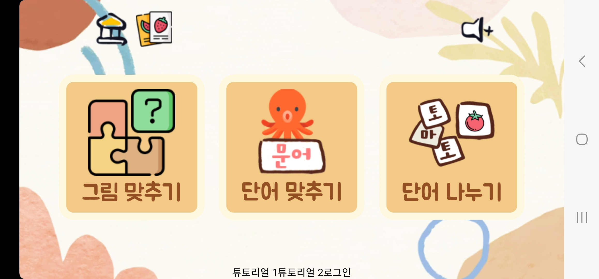

### 그림 맞추기
 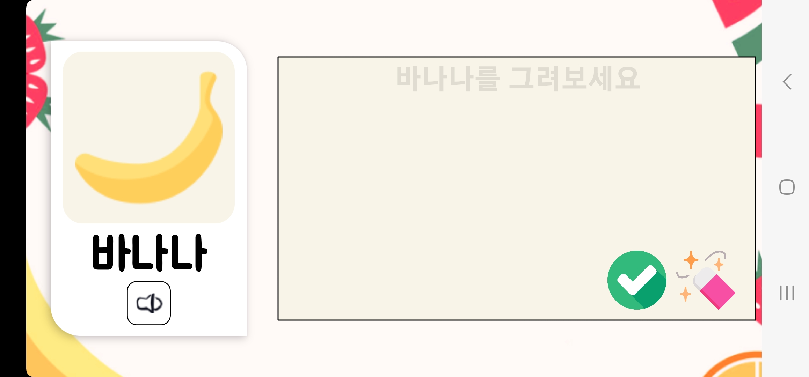
 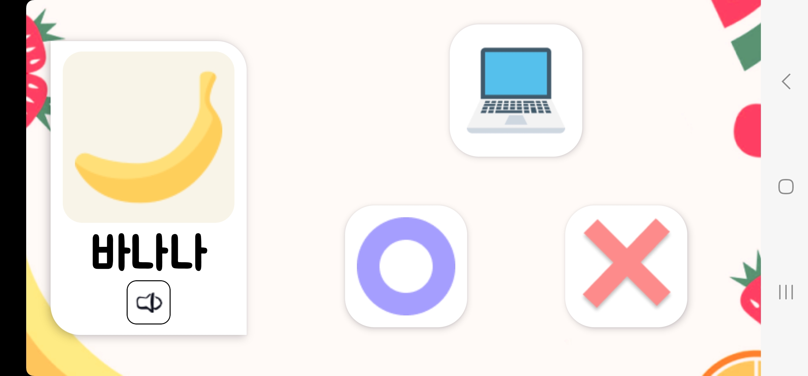
 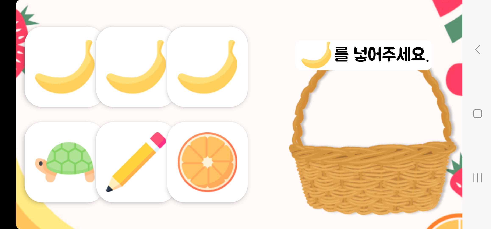

### 단어 맞추기
 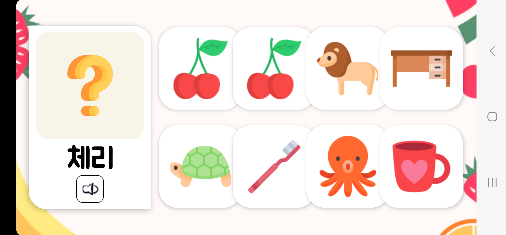
 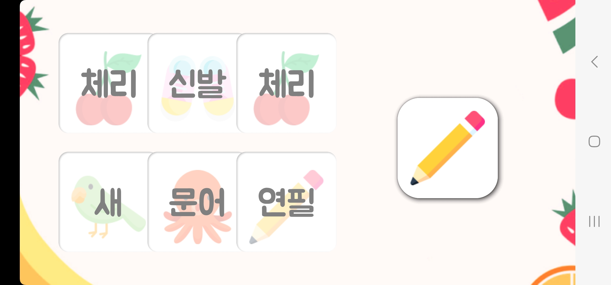
 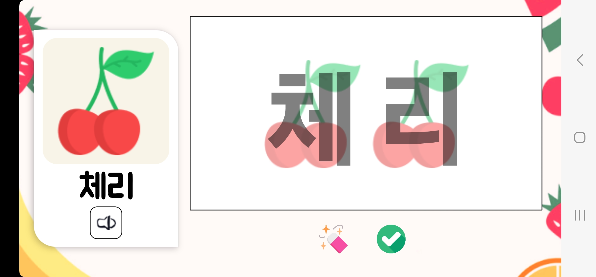

### 단어 나누기
 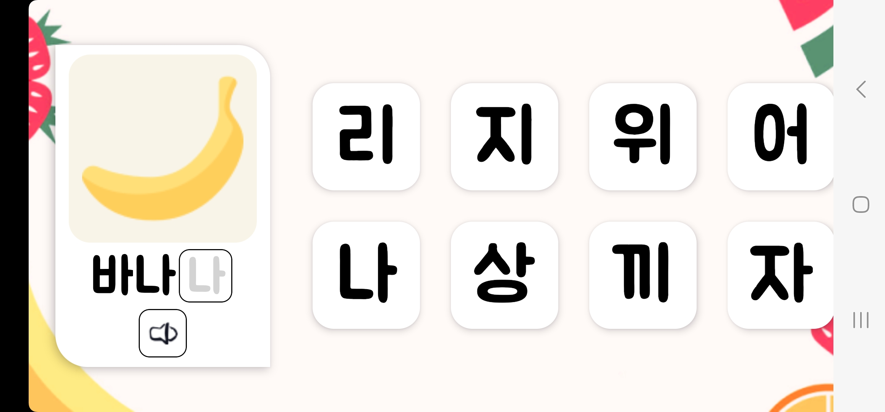
 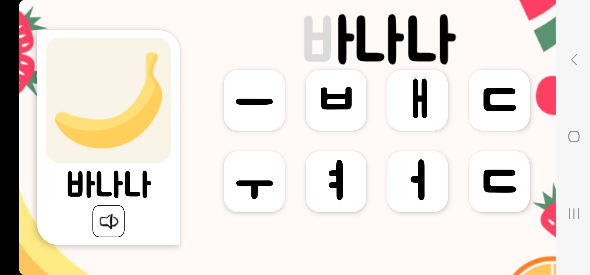
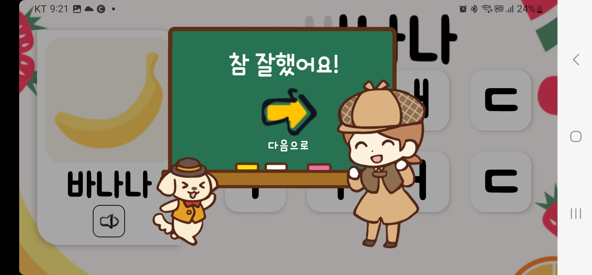  
 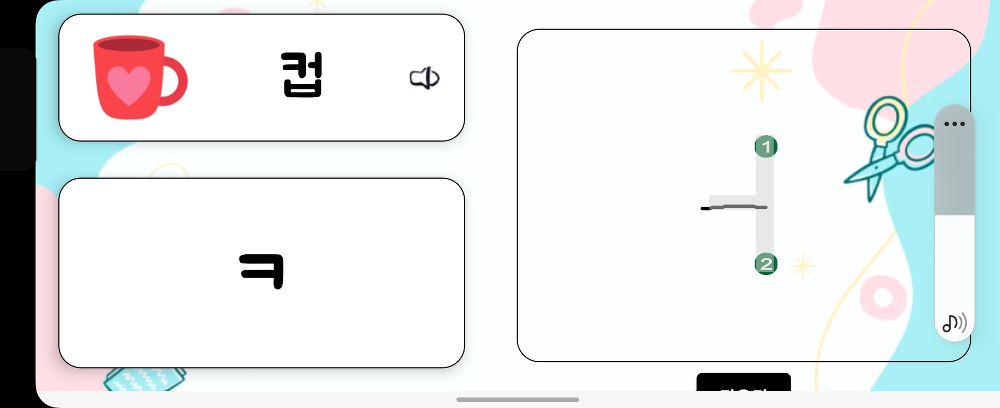
 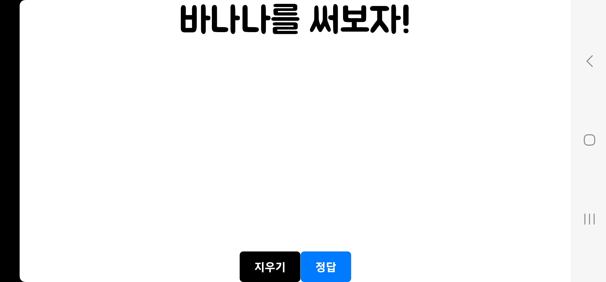
 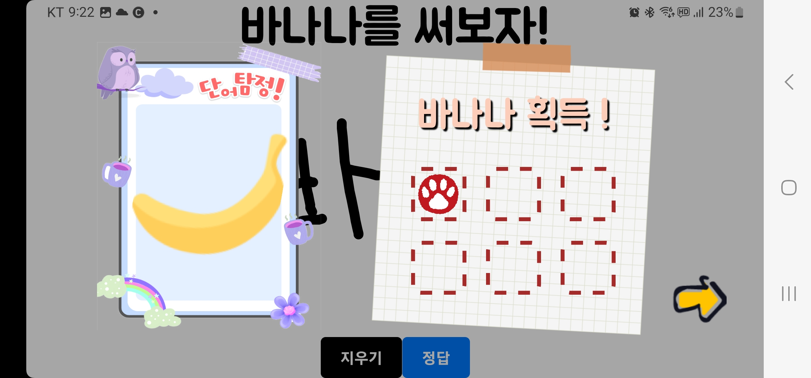

### 단어장
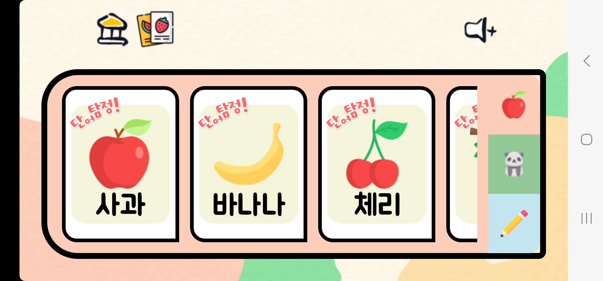
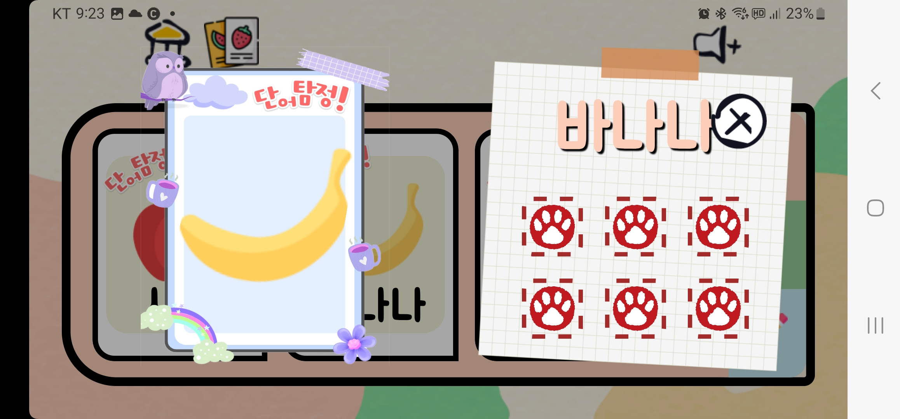 